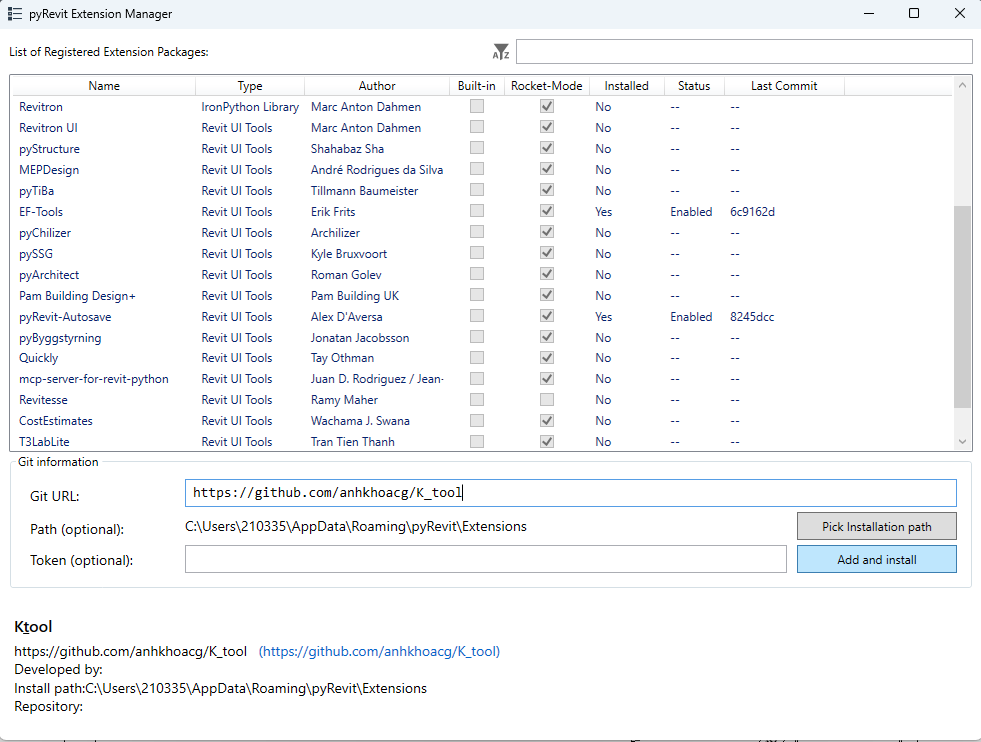
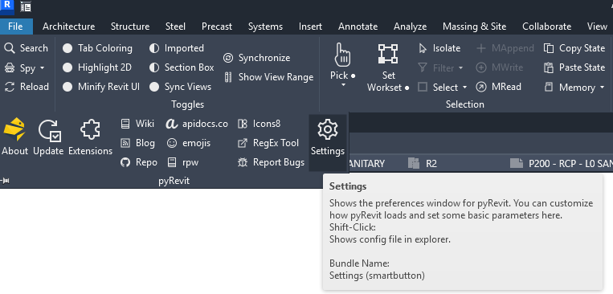
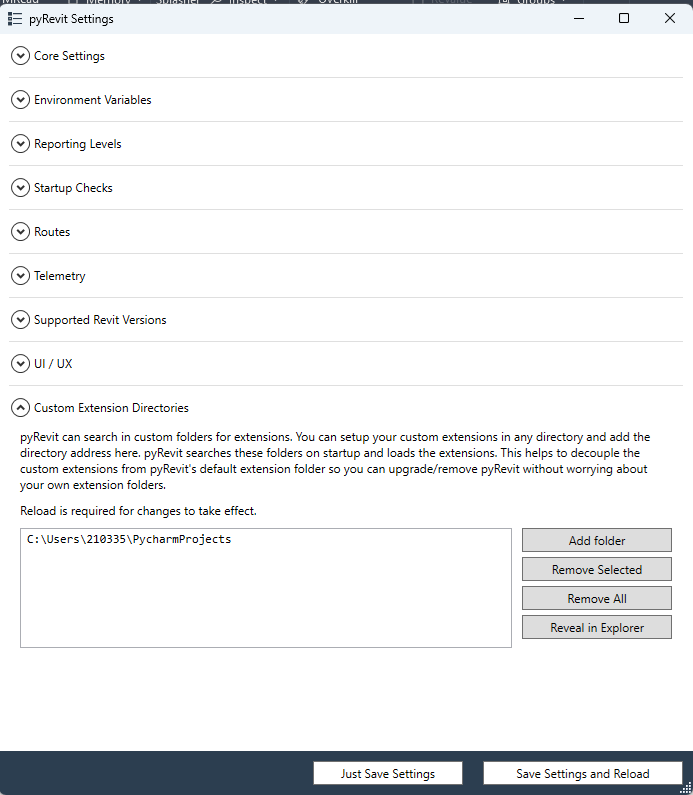

# Cài đặt
## Yêu cầu
- pyRevit (cài đặt từ [pyRevit releases](https://github.com/eirannejad/pyRevit/releases))

## Cách 3 : Cài đặt bằng pyRevit extension manager
1. Mở pyRevit extension manager
2. Điền thông tin sau:
  - GitHub URL: https://github.com/anhkhoacg/K_tool
  - add and install để hoàn tất


## CÁCH 2 : Cài đặt thủ công
   1. Tải về file .zip từ [K_tool releases](https://github.com/anhkhoacg/K_tool/releases)
   2. Giải nén file .zip vào thư mục bạn muốn
   3. Trong Pyrevit chọn settings -> add folder extension.
   4. Chọn thư mục chứa K_tool vừa giải nén
5. Nhấn Save and reload để hoàn tất
6. 
7. 

## CÁCH 1 : Cài đặt bằng lệnh pyRevit CLI
### Các bước cài đặt
1. Mở Command Prompt (WIN+R, gõ 'cmd')
2. Chạy lệnh sau:
   ```
   pyrevit extend ui K_tool https://github.com/anhkhoacg/K_tool --dest="C:\thu_muc_cai_dat" --branch=main
   ```
   Lưu ý: Thay `"C:\thu_muc_cai_dat"` bằng thư mục bạn muốn
3. Khởi động lại Revit hoặc dùng nút reload của pyRevit nếu Revit đang mở
